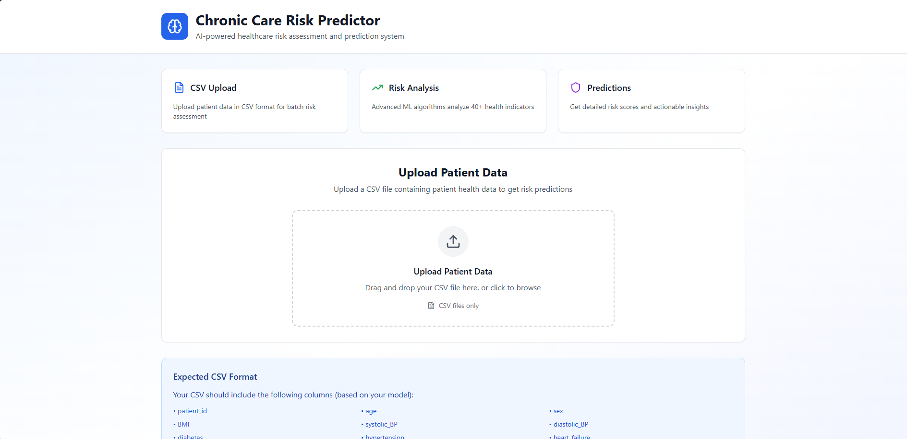

# 🩺 Patient Health Risk Prediction Model  

A machine learning project that predicts patient health risks based on medical records such as demographics, vitals, lifestyle factors, and lab results.  
This project demonstrates how AI can support early detection of health conditions and assist healthcare professionals in clinical decision-making.  

---

## 🚀 Features  
- 📊 Predicts risks for **diabetes, hypertension, heart failure, and kidney disease**  
- 🧠 Uses **Random Forest and Logistic Regression** for high-performance classification  
- ⚡ Trained on structured patient datasets with medical indicators  
- 🌐 Frontend UI for patient input and live predictions  
- 📈 Visualization of patient risk profile & health parameters  

---

## 📸 Project Snapshots  

- **Patient Input Form (Frontend UI)**  
    

- **Prediction Result Page**  
    

---

## 🛠️ Tech Stack  

- **Frontend:** React.js, Tailwind CSS  
- **Backend:** Python (FastAPI / Flask)  
- **ML Models:** LightGBM, XGBoost, scikit-learn  
- **Deployment:** IBM Watsonx.ai, Watson Assistant (future integration)  

---

## 📊 Example Prediction Flow  

1. User enters **patient details** (age, BMI, blood pressure, etc.)  
2. Model processes the input through encoders & ML pipeline  
3. Risk prediction is generated with probability scores  
4. Output is displayed in the **frontend dashboard**  

---

## 📌 Future Work  
- 🔗 Integration with **real-time EHR systems**  
- 🧾 Explainable AI for transparent predictions  
- ☁️ Deployment on **IBM Cloud / Dockerized service**  

---

## 🤝 Contributing  
Want to improve the project? Fork it, create a branch, and submit a PR 🚀  

